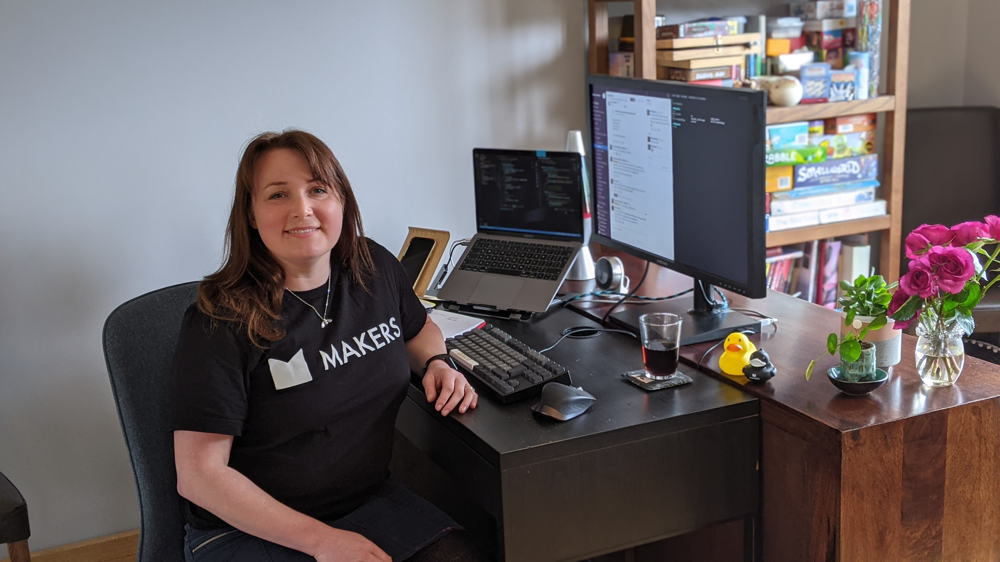

## Rebecca Parker

I am a career-changer, set to finish the [Makers developer bootcamp](https://makers.tech/about-us/) in July 2021 and enter the tech sector as a software engineer. Here I am, making magic happen during my Makers Bootcamp:

## Currently reading/working on
| Title                        | Author            | Notes             |
| ---------------------------- | ----------------- | ----------------- |
| [**Learn React**](https://www.codecademy.com/learn/react-101)| Codecademy | I'm using this to learn the basic syntax of JSX and React for an upcoming project. React promises to be a useful tool to add to my existing Javascript single-page-app skills.|
| **Explore It!: Reduce Risk and Increase Confidence with Exploratory Testing** | Elisabeth Hendrickson | I'm enjoying this read because I'm interested in becoming a stellar tester, using exploratory testing appraches to analyze and investigate software systems. I've found this an easy and engaging read, because the underlying principles seem to echo those I grew confident discussing and applying to good assessment design in my previous role as a Product Manager for an international exam board.|
| **A Philosophy of Software Design** | John Ousterhoust | The author's conclusion that _"Dealing with complexity is the most important challenge in software design"_ matches my experience so far developing software against seemingly simple user stories! This book was recommended to me after my week of work experience at [Redgate Software](https://www.red-gate.com/) and I'm keen to finish it because I've been working on my SOLID and TDD processes to reconcile interative, agile approaches, with the incremental nature of complexity. For each of the projects we've worked on at Makers, I've always found the planning and modelling stages to be secrectly really fascinating, and definitely a key predictor of the final build success.|

## Makers Academy (Apr 2021 to Jul 2021)

### My coding practices
| I can TDD anything | I am a strong debugger  | I write code that is easy to change |
| ------------------ | ----------------------- | ------------------------------------|
| <li> I use the AAA principle to structure my testing and I aim for a 'Red, Green, Refactor, Commit' cycle| <li> I take a methodical approach to digesting error messages; I gather information, get visibility using `p` / `console.log()`, and use effective search terms to google the solution | <li> I'm in the habit of commiting every working change with helpful commit messages, allowing code to be reinstated easily when necessary.|
|Recent reviewer feedback: |Recent reviewer feedback: |Recent reviewer feedback: |
| _"You delivered an amazing process, demonstrating the effort you have invested in learning test triangulation. [...] I believe you are at the stage where you can employ your process in the wild."_ | _"You regularly read the stack trace to ensure that you are up-to-date on all possible bugs [...] and used the output discrepancies to reason about the changes you’d make to your code."_| _"You chose descriptive names that communicated the intention behind your code, improving its human interpretation and thus its changeability. The same goes for your test names. Well done!"_|

### My working practices
- I grow collaboratively
  - Comfortable using github processes for team collaboration on code base
    - PR merge conflict resolution
    - Raising issues and tickets on github project boards
    - Travis and heroku for CI and CD
  - Comfortable using online tools to diagram, explore user stories and plan in teams
  - I thrive in Pair-programming and mob environments
  - I participate with and evolve team rituals (standups, retros etc)

### Technologies I've worked with
- Operating systems: 
   - OSX and Windows
    
- Terminal: 
   - comfortable on linux command line
   - strong git command line
   - some basic powershell knowledge
   
- Languages (in order of proficiency): 
  - Ruby 
  - Javascript
  - SQL 
  - C#
  - Typescript
  - Take a look through [my githib repos](https://github.com/BecaLParker?tab=repositories) or [my codewars solutions](https://www.codewars.com/users/BecaLParker/completed_solutions) to get a feel for my work in these languages.  
  
- Testing syntax and frameworks: 
  - RSPEC (Ruby)
  - Capybara
  - Jasmine
  - Pester

- Web: REACT, Ruby on Rails, HTML, CSS

### Employment history
**Royal Society of Chemistry**   
_Education Executive for trainee teacher scholarship scheme_ (Oct 2018 to Mar 2021)   

- Project managing the recruitment and selection process for up to 150 high-potential specialist Chemistry teachers anually
- Overseeing a support package of continuing professional development and community upkeep for those recruited to the scheme
- Stakeholder engagement
  - working with Government department officials as part of the grant funding agreement for the scheme
  - managing expert external contractors and internal collaborators
- GDPR data handling
- Survey design and analysis
- Unconscious bias mitigation 
- Events coordination

Find out more about the impact of the scholarship scheme in this video. (Can you spot me at 1:45?!) 

_Publishing assistant, Customer relations team_ (Jun 2017 to Oct 2018)
- Subscription-model customer relations
- Internal reporting using MasterVision, DataSalon and salesforce BI data
- Working with authors and other stakeholders to meet publication goals for peer-review scientifc journals

**Cambridge Assessment** (start-date to end-date)  
_Product Manager_

- Managing 34 external expert consultants and internal colleagues to deliver a continuous cycle of language assessments
- Working with demanding briefs, requirements and contraints
- Statisical data anlaysis
  - examiner standardisation
  - centre moderation and scaling
  - grading of approximately 7,000 candidates annually 
- Influencing team processes to implement assessment and testing best practices
- Information and requirement gathering
- Contributing to working groups for improving internal policy and processes

**Stanley Park High School** (start-date to end-date)  
_Secondary School Teacher, Modern Foreign Languages_

**Freelance** (start-date to end-date)  
_Translation, web editing and project management_

- Working with consultancy cleints to deliver the build and maintenance of investor relations webpages.
- Remote co-ordinating cross-functional teams working in multiple international sites to project manage Annual Reports microsite for a key client.
- Quality control
  - proofreading and editing HTML code in various content management systems (CMS)
  - Search Engine Optimization (SEO), 
  - accessibility considerations, 
  - stylistic implications of writing for the web and mobile web devices.

**Credit Suisse** (start-date to end-date)  
_Personal Assistant to Managing Director_

- Providing level-headed, logistical support in a large interantional organisation.
- Operating alongside senior board members.
- Valuable insight into the financial services industry.

## Certifications

#### Roehampton University
- PGCE secondary MFL teaching

#### Chartered Institute of Linguists
- Postgraduate Diploma in Translation
- French into English
- Specialism: scientific and technical texts

#### Keele University
- French with Spanish
- First class honours

## Hobbies

Away from my desk, I recharge by running, gardening, reading and catching up on boxsets. 

I love getting to know a new workteam through things like quizzes, boardgames, escape-rooms and kareoke.

